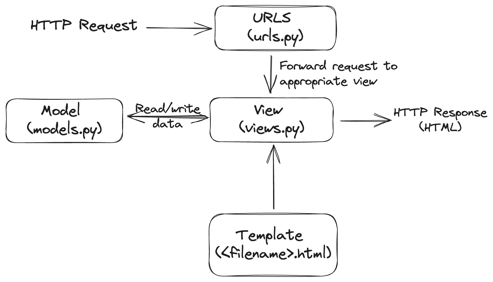
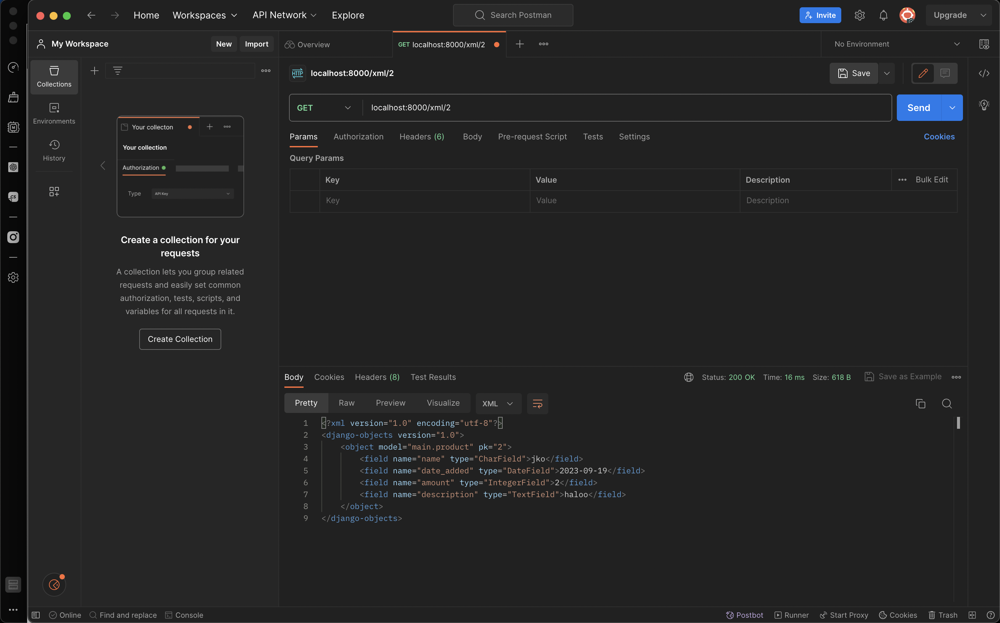
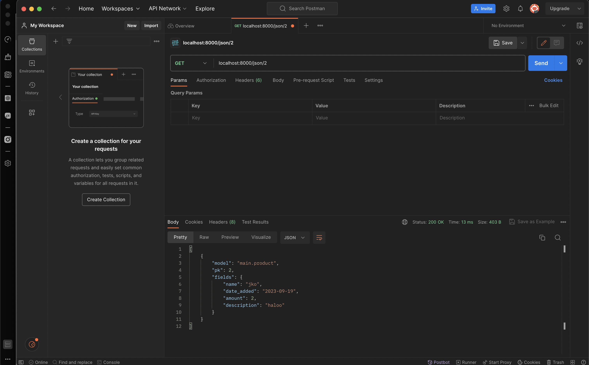
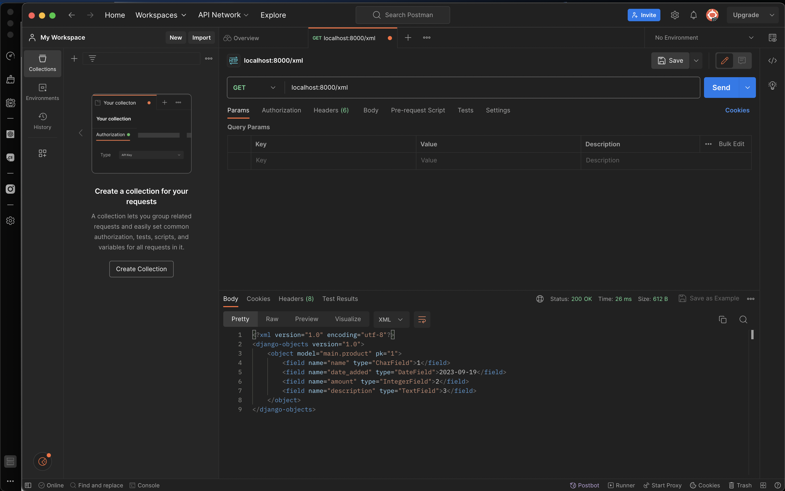
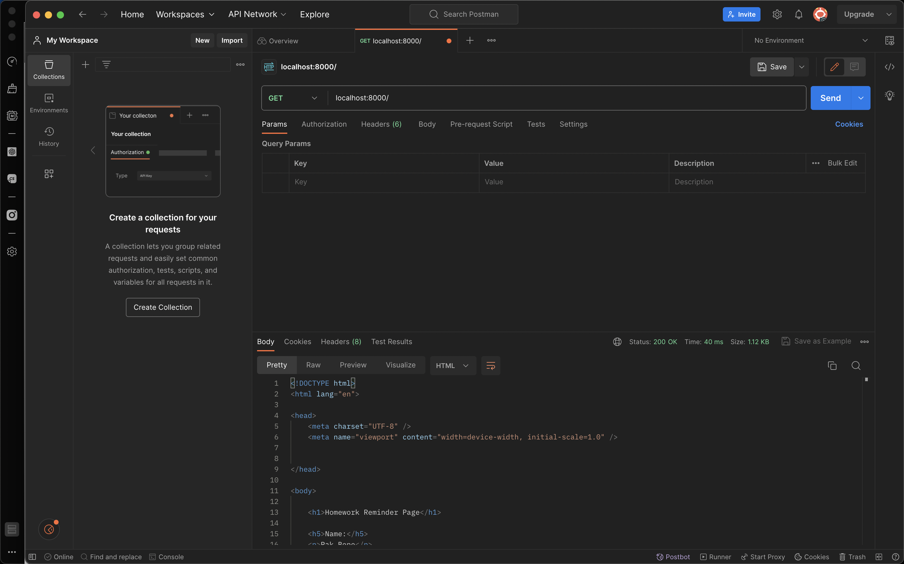

Link Deployment:
https://homeworkreminders.up.railway.app

# Tugas 2

# Panduan Implementasi

## Persiapan
Pertama-tama, saya memastikan bahwa saya memiliki semua yang dibutuhkan untuk mengimplementasikan proyek ini. Berikut adalah langkah-langkah yang perlu saya lakukan:

### 1. Setup Library yang Dibutuhkan
Langkah pertama adalah membuat file requirements.txt yang berisi daftar library yang diperlukan untuk proyek ini. Saya dapat membuatnya dengan menambahkan library berikut ke dalam file tersebut:

django
gunicorn
whitenoise
psycopg2-binary
requests
urllib3

Setelah itu, saya dapat menginstal semua library ini dengan menjalankan perintah berikut di terminal:

#### Tanpa Virtual Environment
sh
pip install -r requirements.txt

#### Menggunakan Virtual Environment
sh
python -m venv venv # Buat virtual env
./venv/Scripts/activate # pada Windows atau
source venv/Scripts/activate # pada Mac
pip install -r requirements.txt

## 2. Membuat Proyek Django Baru
Selanjutnya, saya perlu membuat proyek Django baru. Saya dapat melakukannya dengan menggunakan perintah django-admin createproject NAMA_PROYEK. Ini akan membuat direktori baru dengan nama NAMA_PROYEK, yang akan berisi file manage.py dan folder NAMA_PROYEK yang berisi pengaturan dan routing proyek.

Saya dapat menjalankan proyek dengan perintah python manage.py runserver. Pastikan untuk menjalankannya sebelum mengakses http://localhost:8000/main, yang merupakan URL web Django saya.

## 3. Membuat Aplikasi "main"
Selanjutnya, saya perlu membuat aplikasi dengan nama "main" di dalam proyek saya. Saya dapat melakukannya dengan perintah python manage.py createapp NAMA_APLIKASI. Setelah membuat aplikasi, saya perlu mendaftarkannya di dalam file settings.py yang berada di dalam folder proyek. Saya tambahkan nama aplikasi tersebut ke dalam INSTALLED_APPS seperti ini:

python
INSTALLED_APPS = [
    'django.contrib.admin',
    'django.contrib.auth',
    'django.contrib.contenttypes',
    'django.contrib.sessions',
    'django.contrib.messages',
    'django.contrib.staticfiles',
    'NAMA_APLIKASI'
]

## 4. Konfigurasi Routing Proyek
Untuk menjalankan aplikasi yang telah saya buat, saya perlu mengkonfigurasi routing proyek saya. Saya menambahkan path yang mengarah ke aplikasi tersebut di dalam file urls.py yang berada di dalam direktori proyek. Contohnya, jika saya ingin menggunakan path /iniapp untuk aplikasi "main", saya tambahkan ini ke dalam urls.py:

python
from django.contrib import admin
from django.urls import path, include

urlpatterns = [
    path('admin/', admin.site.urls),
    path('main/', include('main.urls'))
]

Selanjutnya, saya buat file urls.py di dalam folder "main" dengan kode berikut:

python
from django.urls import path
from . import views

urlpatterns = [
    path('', views.main),
]

Dengan konfigurasi ini, ketika saya mengakses http://localhost:8000/iniapp/main di browser, saya akan melihat apa yang dikembalikan oleh fungsi main yang ada di dalam file views.py.

Jika saya ingin aplikasi saya berada langsung di path utama, seperti http://localhost:8000/main, saya bisa mengatur urlpatterns di dalam file urls.py proyek dengan cara ini:

python
path('', include('main.urls'))

## 5. Membuat Fungsi Render pada views.py
Untuk mengatur tampilan yang akan dilihat oleh pengguna ketika mengakses http://localhost:8000/main, saya perlu membuat halaman HTML. Saya buat direktori templates di dalam folder "main" dan tambahkan file HTML yang akan saya tampilkan, misalnya main.html. Isi file main.html dengan kode berikut:

html
<h1>Homework Reminder Page</h1>
<h5>Name: </h5>

{{ name }}

<h5>Jumlah: </h5>

{{ amount }}

<h5>Penjelasan: </h5>

{{ description }}

Kemudian, di dalam file views.py, saya dapat mengembalikan halaman HTML tersebut dengan menggunakan fungsi render seperti ini:

python
from django.shortcuts import render

def show_main(request):
    context = {
        'name': 'Pak Bepe',
        'amount': 3,
        'description': 'Tugas Kuliah'
    }

    return render(request, "main.html", context)

Perubahan ini akan langsung terlihat ketika saya mengakses http://localhost:8000/main.

## 6. Membuat Model Sebagai Database
Jika saya ingin menggunakan database, saya perlu membuat model yang akan menjadi penghubung antara Python dan database saya. Model ini akan berada di dalam file models.py di dalam aplikasi "main". Sebagai contoh, jika saya ingin membuat database yang berisi informasi tentang barang dengan atribut nama, jumlah, dan deskripsi, saya dapat membuat model seperti ini:

python
from django.db import models

class Item(models.Model):
    name = models.CharField(max_length=100)
    amount = models.IntegerField()
    description = models.TextField()

Namun, untuk menghubungkan model ini dengan tampilan, saya perlu melakukan lebih banyak konfigurasi yang akan dibahas dalam tutorial PBP selanjutnya.

## 7. Melakukan Deploy ke Adaptable
Terakhir, jika saya ingin mendeploy proyek saya ke Adaptable, pastikan repositori proyek saya sudah berada di GitHub dan bersifat public. Selanjutnya, di Adaptable, pilih opsi "deploy a new app" dan pilih repositori yang sesuai dengan proyek yang akan saya deploy. Pilih template "Python App Template" dan tentukan jenis database yang saya inginkan, misalnya "PostgreSQL".

Pastikan untuk sesuaikan versi Python dengan versi yang digunakan di lingkungan lokal saya dengan menjalankan python --version di terminal lokal. Selanjutnya, masukkan perintah python manage.py migrate && gunicorn NAMA_PROYEK.wsgi ke dalam kolom "Start Command". Akhirnya, tentukan nama aplikasi saya dan centang opsi "HTTP Listener on PORT".

Ketika ada permintaan dari luar, Django akan mencoba mencari pola URL yang ada dalam file urls.py. Setelah menemukan pola URL yang sesuai dengan yang telah kita tulis, Django akan mengakses fungsi yang sesuai dalam file views.py sesuai dengan pola URL yang dituju. Di dalam fungsi yang dipanggil, kita memiliki kemampuan untuk menulis, membaca, menghapus, dan memperbarui basis data. Setelah itu, kita dapat mengirimkan halaman HTML yang akan dirender oleh browser pengguna.

Virtual environment digunakan untuk mengisolasi dependensi proyek, mencegah konflik, menjaga kebersihan sistem, dan memungkinkan portabilitas. Meskipun mungkin bisa membuat aplikasi web Django tanpa virtual environment, secara umum virutal environment digunakan untuk mencegah masalah dependensi dan konflik.

MVC (Model-View-Controller): Memisahkan data (Model), tampilan (View), dan logika pengendalian (Controller).
MVT (Model-View-Template): Sama seperti MVC, dengan Template yang memisahkan tampilan.
MVVM (Model-View-ViewModel): Memisahkan Model, tampilan (View), dan ViewModel yang menghubungkan keduanya, umumnya digunakan dalam aplikasi UI dinamis seperti aplikasi mobile.

# Tugas 3

# Panduan Implementasi

## 

## Membuat Form (forms.py)

APP/forms.py akan mengimplementasikan django.forms yang mempermudah pembuatan form kita. html sudah dihandle oleh library form tersebut. Contoh isi APP/forms.py adalah.
python
from main.models import Item
class ProductForm(ModelForm):
    class Meta:
        model = Product
        fields = ["name", "amount", "description"]

dimana name, amount, dan description adalah field yang ada pada model Product yang sudah didefinisikan.

## Merender form yang dibuat

Kemudian, kita membuat HTML seperti berikut untuk merender form yang telah dibuat.
html
<form method="POST">
    
    <table>
        {{ form.as_table }}
        <tr>
            <td></td>
            <td>
                <input type="submit" value="Add Product"/>
            </td>
        </tr>
    </table>
</form>

## Menambahkan view untuk serializer json dan xml

Serializer digunakan untuk mengirim data dalam format JSON atau XML, yang kemudian dapat digunakan sebagai antarmuka program lain (API). Dalam Django, serializer diimplementasikan di dalam views.py dengan mengembalikan HTTPResponse dengan tipe konten application/json atau application/xml. Di bawah ini adalah contoh kode implementasinya:

from django.core import serializers
from main.models import Item
def show_xml(request):
    data = Item.objects.all()
    return HttpResponse(serializers.serialize('xml', data), content_type='application/xml')

def show_json(request):
    data = Item.objects.all()
    return HttpResponse(serializers.serialize('json', data), content_type='application/json')

## Membuat getter dengan dynamic routing

Untuk mengimplementasikan dynamic routing dalam Django, kita perlu mengubah file urls.py dan views.py. Berikut adalah contoh bagaimana cara melakukannya:

from django.urls import path

urlpatterns = [
    ...
    path('xml/<int:id>', views.show_xmlbyid, name='xmlbyid'),
    path('json/<int:id>', views.show_jsonbyid, name='jsonbyid'),
]

Sedangkan pada views.py

def show_xmlbyid(request, id: int):
    data = Item.objects.filter(pk=id)
    print(data)
    return HttpResponse(serializers.serialize('xml', data), content_type='application/xml')

def show_jsonbyid(request, id: int):
    data = Item.objects.filter(pk=id)
    return HttpResponse(serializers.serialize('json', data), content_type='application/json')

## Perbedaan antara POST dan GET pada Django?

POST adalah metode protokol HTTP yang digunakan untuk mengirim data melalui body request, sehingga data tersebut tidak terlihat dengan mudah. Biasanya digunakan untuk melakukan pembaruan data pada server, seperti pendaftaran (sign up) atau pengunggahan file.

Sementara itu, GET adalah metode protokol HTTP yang berfokus pada kesederhanaan. Data yang dikirim disimpan dalam URL yang dituju. Sebagai contoh, saat mencari video di YouTube, URL akan berisi pola seperti youtube.com/results?search_query=[KEYWORD PENCARIAN]. Oleh karena itu, karena data dikirim melalui URL, metode GET tidak cocok untuk mengirimkan data rahasia, seperti saat melakukan pendaftaran. Menggunakan metode GET untuk hal seperti itu akan terlihat aneh. Metode GET cocok untuk mengambil data, seperti file HTML dari situs web yang perlu di-render, atau mengirim permintaan ke database, seperti insta/user/satu untuk mendapatkan informasi tentang pengguna "satu".

## Perbedaan utama antara XML, JSON, dan HTML dalam konteks pengiriman data?

HTML digunakan untuk membuat halaman web dengan desain, konten, dan script. Lebih cocok digunakan jika pengguna adalah manusia yang menggunakan browser. Tidak efisien jika digunakan oleh aplikasi untuk mengambil data otomatis.

XML adalah format yang dapat dibaca oleh manusia dan mesin. Strukturnya mirip pohon dengan satu root dan mirip dengan HTML. Setiap node di XML ditandai dengan simbol <>. Biasanya digunakan untuk mengirim data melalui API.

JSON adalah format yang mudah dibaca oleh manusia dan mesin. Format yang sering digunakan saat ini karena sederhana. Menggunakan Dictionary dan List untuk container membuatnya mudah dibaca oleh program API.

## Mengapa JSON sering digunakan dalam pertukaran data antara aplikasi web modern?
JSON sering digunakan sebagai sarana pertukaran data antara aplikasi (API) karena sifatnya yang mudah dibaca oleh mesin. Dalam JSON, terdapat dictionary dan list sebagai wadah data yang sering digunakan oleh para pengembang perangkat lunak. Penulisan JSON lebih ringkas dibandingkan XML, yang membuatnya lebih efisien dari segi ukuran dan lebih mudah dibaca oleh manusia.

# Screenshot Postman

## Tugas 4

# Panduan Implementasi

## Membuat fungsi dan form registrasi 
Saya membuat fungsi register pada views.py dan membuat HTML register.html yang dibuka saat seseorang mencoba mengakses halaman register. Saya kemudian menambahkan path url untuk register kedalam urls.py

## Membuat fungsi login 
Saya membuat fungsi login pada views.py dan membuat HTML login.html yang dibuka saat seseorang mencoba mengakses halaman login. Saya kemudian menambahkan path url untuk login kedalam urls.py

## Membuat fungsi logout 
Saya membuat fungsi logout pada views.py dan membuat tombol logout pada main.html. Saya kemudian menambahkan path url untuk logout kedalam urls.py

## Merestriksi akses halaman main
Saya menambahkan requirement login required untuk mengakses main, jadi hanya pengguna yang sudah login yang bisa masuk ke main.

## Menggunakan data dari cookies
Saya menggunakan cookies untuk mengakses terakhir kali user login, dan menampilkan last login pada page main.html

## Menghubungkan product dengan user
Saya memberikan hubungan antara masing-masing product dengan user, sehingga product hanya dapat diakses oleh user yang membuatnya

## Apa itu Django UserCreationForm, dan jelaskan apa kelebihan dan kekurangannya?
UserCreationForm adalah formulir bawaan Django untuk pendaftaran pengguna.
Kelebihannya adalah kemudahan penggunaan dan integrasi dengan otentikasi Django.
Kekurangannya adalah kurangnya kustomisasi ekstensif.

## Apa perbedaan antara autentikasi dan otorisasi dalam konteks Django, dan mengapa keduanya penting?
Autentikasi adalah verifikasi identitas pengguna.
Otorisasi mengatur izin akses pengguna.
Keduanya penting untuk memastikan identitas dan kontrol akses.

## Apa itu cookies dalam konteks aplikasi web, dan bagaimana Django menggunakan cookies untuk mengelola data sesi pengguna?
Cookies adalah data kecil di browser untuk sesi dan preferensi pengguna.
Django menggunakan cookies untuk mengelola sesi pengguna.
Ini membantu mengidentifikasi pengguna dan menyimpan informasi sesi.

## Apakah penggunaan cookies aman secara default dalam pengembangan web, atau apakah ada risiko potensial yang harus diwaspadai?
Penggunaan cookies aman jika dienkripsi dengan baik dan terhindar dari XSS.
HTTPS dianjurkan untuk mencegah session hijacking.
Proteksi CSRF dan praktik terbaik dalam pengembangan web penting untuk keamanan.

## Tugas 5

## Panduan implementasi

Pertama, saya memberikan styling warna, font, dan text-align pada masing-masing elemen dalam main.html

Saya juga memberikan border, padding, dan text-align pada tabel.
Untuk mengakses baris terakhir dalam tabel, saya menggunakan last-child, yang memiliki prioritas paling tinggi dibandingkan dengan getter-getter lain saya, sehingga ia mengoverride pewarnaan lainnya.

Cara untuk file-file lain cukup serupa, dimana perbedaan utama adalah saya menggunakan class selector dalam register, create_product, dan login.html 

1. **Manfaat dari Setiap Element Selector dan Waktu yang Tepat untuk Menggunakannya:**

   - **Element Selector (`element`)**: Selector ini berguna untuk menggaya semua elemen dengan jenis yang sama dalam halaman web. Ini cocok digunakan ketika ingin memberikan gaya seragam pada semua elemen yang sama jenisnya.

   - **Class Selector (`.class`)**: Selector ini digunakan untuk menggaya elemen dengan class tertentu. Dapat digunakan ketika ingin mengaplikasikan gaya khusus pada beberapa elemen dengan class yang sama.

   - **ID Selector (`#id`)**: Selector ini digunakan untuk menggaya elemen dengan ID tertentu. Ini cocok digunakan ketika hanya ingin mengaplikasikan gaya pada elemen tunggal yang memiliki ID tertentu.

   - **Pseudo-class Selector (`:pseudo-class`)**: Selector ini berguna untuk menggaya elemen dalam keadaan khusus, seperti `:hover` untuk mengubah tampilan saat kursor berada di atasnya.

   - **Attribute Selector (`[attribute]`)**: Selector ini berguna untuk memilih elemen berdasarkan atributnya, misalnya `[target="_blank"]` untuk memilih tautan yang membuka dalam tab baru.

   - **Universal Selector (`*`)**: Selector ini berguna untuk menggaya semua elemen dalam halaman web. Digunakan untuk mengatur gaya dasar situs secara keseluruhan.

   - **Descendant Selector (`ancestor descendant`)**: Selector ini digunakan untuk memilih elemen yang merupakan turunan dari elemen yang lebih tinggi dalam hierarki.

   - **Child Selector (`parent > child`)**: Selector ini digunakan untuk memilih elemen yang merupakan anak langsung dari elemen induk.

2. **HTML5 Tag yang Dikenal:**

   Beberapa tag HTML5 yang umum dan penting meliputi `<header>`, `<nav>`, `<main>`, `<article>`, `<section>`, `<aside>`, `<footer>`, `<video>`, `<audio>`, `<canvas>`, `<form>`, `<input>`, `<button>`, dan lain-lain.

3. **Perbedaan Antara Margin dan Padding:**

   - **Margin**: Margin adalah ruang di luar batas luar elemen. Ini mengatur jarak antara elemen dengan elemen lainnya di sekitarnya.

   - **Padding**: Padding adalah ruang di dalam batas luar elemen. Ini mengatur jarak antara batas luar elemen dan kontennya.

4. **Perbedaan Antara Framework CSS Tailwind dan Bootstrap:**

   - **Tailwind CSS**: Tailwind adalah framework CSS yang bersifat utility-first, memungkinkan penggunaan kelas-kelas utilitas untuk mengatur tampilan. Cocok untuk proyek dengan desain kustom dan fleksibilitas tinggi.

   - **Bootstrap**: Bootstrap adalah framework CSS yang menyediakan komponen UI yang sudah jadi dan gaya default. Cocok untuk prototyping dan proyek dengan tenggat waktu singkat.

   **Kapan Menggunakan Bootstrap atau Tailwind?**

   - Gunakan **Bootstrap** untuk proyek yang memerlukan pengembangan cepat dan tidak memerlukan penyesuaian gaya yang mendalam.

   - Gunakan **Tailwind CSS** untuk proyek yang memerlukan kontrol detail atas tampilan dan desain yang sangat kustom.

## Tugas 6

## Panduan Implementasi

Pertama, saya menyiapkan sebuah fungsi di `views.py` untuk mengambil informasi produk dari pengguna menggunakan teknologi Ajax. Fungsi tersebut bertujuan untuk mengambil objek yang terkait dengan `request.user` dari database dan kemudian mengembalikan data dalam format JSON. Selanjutnya, saya melakukan konfigurasi rute untuk fungsi ini di berkas `urls.py`. Selain itu, saya melakukan perubahan dalam cara tampilan data produk di halaman `main.html` dengan menerapkan JavaScript dan Ajax. Saya juga menambahkan dua fungsi, yaitu `getItem` dan `refreshItems`, agar dapat menampilkan data dengan menggunakan Ajax dan secara otomatis memperbarui halaman.

Selanjutnya, saya menyiapkan sebuah fungsi di `views.py` yang bertujuan untuk menambahkan produk dari pengguna melalui teknologi Ajax. Fungsi tersebut dinamakan `add_user_product` dan berfungsi mengambil data dari `request.POST`, lalu menambahkan produk baru ke dalam database. Saya juga mengonfigurasi rute untuk fungsi ini di berkas `urls.py` dengan nama `add_user_` dan endpoint `/create-ajax`. Di halaman `main.html`, saya juga menambahkan fungsi `addItem` untuk mengirim permintaan ke endpoint `/create-ajax` dengan menggunakan Ajax, serta secara otomatis memperbarui halaman.

Terakhir, untuk menjalankan operasi `collectstatic`, saya membuat sebuah direktori bernama `static` di direktori utama proyek dan menambahkan pengaturan `STATIC_ROOT = os.path.join(BASE_DIR, 'static')` di berkas `settings.py`. Selanjutnya, saya menjalankan perintah `python manage.py collectstatic` untuk mengumpulkan berkas-berkas statis ke dalam folder `static` yang baru saja saya buat. Saya juga melakukan penambahan variabel `ALL_ALLOWED_HOSTS` di berkas `settings.py` guna menghindari terjadinya kesalahan csrf saat melakukan proses deployment.

1. **Jelaskan perbedaan antara asynchronous programming dengan synchronous programming.**
Dalam asynchronous programming, tugas dijalankan secara berurutan satu per satu, sedangkan dalam synchronous programming, beberapa tugas dapat dijalankan secara bersamaan tanpa harus menunggu tugas sebelumnya selesai terlebih dahulu.

2. **Dalam penerapan JavaScript dan AJAX, terdapat penerapan paradigma event-driven programming. Jelaskan maksud dari paradigma tersebut dan sebutkan salah satu contoh penerapannya pada tugas ini.**
Event-driven programming adalah paradigma pemrograman di mana program berjalan sebagai respons terhadap kejadian atau event yang terjadi. Contoh penerapannya dalam tugas ini adalah saat kita mengklik tombol untuk menambahkan item menggunakan AJAX, yang mengakibatkan munculnya modal form untuk menambahkan item.

3. **Jelaskan penerapan asynchronous programming pada AJAX.**
Penggunaan asynchronous programming dalam AJAX adalah ketika kita mengirim permintaan (request) ke server, tidak perlu menunggu respons dari server sebelum melanjutkan kode program berikutnya. Cara ini dapat diimplementasikan dengan menambahkan kata kunci "async" ke dalam fungsi yang mengirim permintaan ke server, dan menggunakan kata kunci "await" sebelum operasi "fetch" untuk menunggu respons dari server.

4. **Pada PBP kali ini, penerapan AJAX dilakukan dengan menggunakan Fetch API daripada library jQuery. Bandingkanlah kedua teknologi tersebut dan tuliskan pendapat kamu teknologi manakah yang lebih baik untuk digunakan.**
Fetch API adalah antarmuka program aplikasi (API) JavaScript yang lebih modern, ringan, dan mudah digunakan. Di sisi lain, jQuery adalah sebuah library JavaScript yang sudah ada sejak lama, menyediakan lebih banyak fitur, dan memiliki kompatibilitas lintas browser yang kuat. Pilihan antara keduanya sangat tergantung pada kebutuhan proyek, namun untuk proyek-proyek modern, penggunaan Fetch API biasanya lebih direkomendasikan karena sederhana, efisien, dan lebih sesuai dengan standar terbaru dalam pengembangan web.
